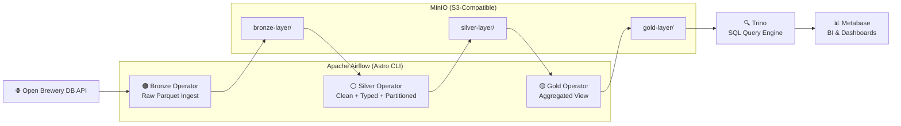
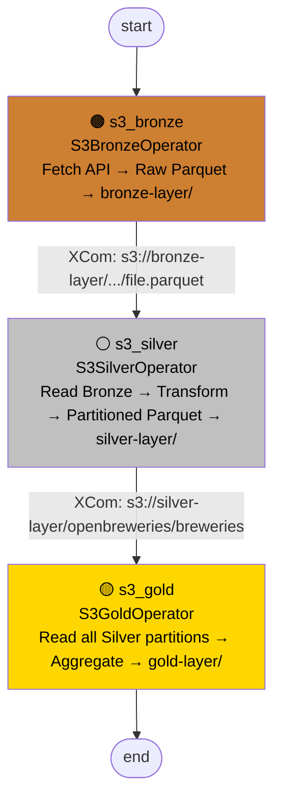
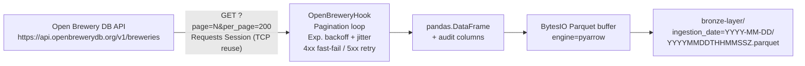
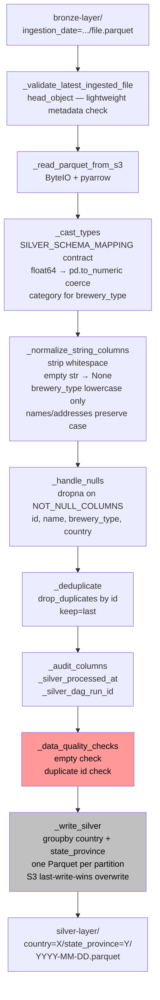
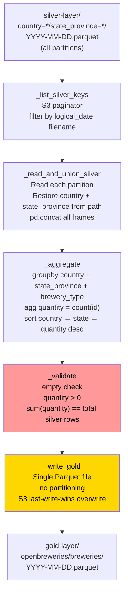
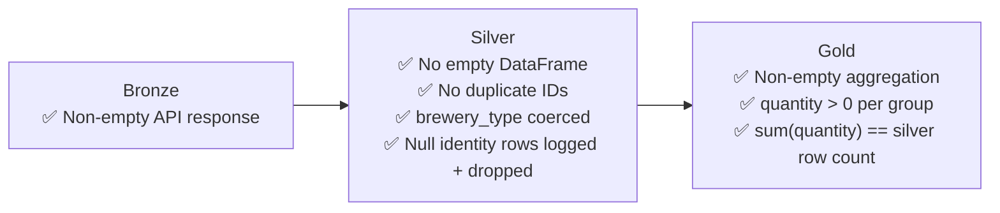

# 🍺 Bees Challenge — Brewery Data Pipeline

A production-grade **medallion architecture** data pipeline built with Apache Airflow (Astro CLI), MinIO, Trino, and Metabase — running entirely on your local machine via Docker.

The pipeline ingests brewery data from the [Open Brewery DB API](https://www.openbrewerydb.org/), transforms it through **Bronze → Silver → Gold** layers, and exposes the aggregated results for SQL querying and BI visualization.

---

## Table of Contents

- [Architecture Overview](#architecture-overview)
- [Tech Stack](#tech-stack)
- [Project Structure](#project-structure)
- [Prerequisites](#prerequisites)
- [Setup & Installation](#setup--installation)
- [Airflow Connections](#airflow-connections)
- [Running the Pipeline](#running-the-pipeline)
- [Medallion Layers — Design & Transformations](#medallion-layers--design--transformations)
  - [Bronze Layer](#bronze-layer)
  - [Silver Layer](#silver-layer)
  - [Gold Layer](#gold-layer)
- [Data Quality](#data-quality)
- [Querying with Trino + Metabase](#querying-with-trino--metabase)
- [Tests](#tests)
- [Monitoring & Alerting](#monitoring--alerting)
- [Service Access](#service-access)
- [AI Diligence Statement](#ai-diligence-statement)

---

## Architecture Overview



---

## Tech Stack

| Tool | Role | Analogy |
|---|---|---|
| **Airflow (Astro CLI)** | Pipeline orchestration, scheduling, retries | The conductor |
| **MinIO** | S3-compatible object storage for the data lake | AWS S3 / GCS |
| **Trino** | Distributed SQL query engine over Parquet files | AWS Athena / BigQuery engine |
| **Metabase** | BI tool for SQL queries and dashboards | Looker / Google Data Studio |
| **Docker** | Containerises all services | Infrastructure layer |

---

## Project Structure

```
bees-challenge/
├── dags/
│   ├── bees_challenge_dag.py         ← DAG definition (wiring only)
│   └── plugins/
│       ├── hooks/
│       │   └── open_brewery_hook.py  ← API pagination + retry logic
│       ├── operators/
│       │   ├── s3_bronze_operator.py ← Raw ingest to bronze S3
│       │   ├── s3_silver_operator.py ← Transform + partition to silver S3
│       │   └── s3_gold_operator.py   ← Aggregate to gold S3
│       └── utils/
│           ├── aws_s3_utils.py       ← S3Handler (MinIO boto3 wrapper)
│           └── constants.py          ← Centralized configuration
├── include/
│   └── trino/
│       └── catalog/
│           └── minio.properties      ← Trino → MinIO connection config
├── tests/                            ← Unit tests
├── docker-compose.override.yml       ← MinIO, Trino, Metabase services
├── Dockerfile                        ← Astro Runtime image
├── requirements.txt                  ← Python dependencies
├── packages.txt                      ← OS-level dependencies
└── airflow_settings.yaml             ← Airflow connections + variables
```

---

## Prerequisites

Before starting, ensure you have the following installed:

- [Docker Desktop](https://docs.docker.com/desktop/) — must be running
- [Astro CLI](https://www.astronomer.io/docs/astro/cli/overview) — Astronomer's Airflow CLI

### Install Astro CLI

**macOS (Homebrew):**
```bash
brew install astro
```

**Linux:**
```bash
curl -sSL https://install.astronomer.io | sudo bash
```

**Windows (WinGet):**
```bash
winget install -e --id Astronomer.Astro
```

Verify installation:
```bash
astro version
```

---

## Setup & Installation

### 1. Clone the repository

```bash
git clone <your-repo-url>
cd bees-challenge
```

### 2. Install Python dependencies

```bash
pip install -r requirements.txt
```

### 3. Start all services

```bash
astro dev start
```

This command spins up **8 Docker containers**:

| Container | Purpose |
|---|---|
| `postgres` | Airflow metadata database |
| `scheduler` | Monitors and triggers tasks |
| `dag-processor` | Parses DAG files |
| `api-server` | Serves the Airflow UI |
| `triggerer` | Handles deferred tasks |
| `minio` | Object storage (data lake) |
| `trino` | SQL query engine |
| `metabase` | BI / dashboard tool |

> **Port conflict?** If port `8080` is already in use, see [Astro troubleshooting](https://www.astronomer.io/docs/astro/cli/troubleshoot-locally#ports-are-not-available-for-my-local-airflow-webserver).

### 4. Create MinIO buckets

Access the MinIO Console at [http://localhost:9001](http://localhost:9001) with credentials `admin / password` and create the following buckets:

- `bronze-layer`
- `silver-layer`
- `gold-layer`

Or create them programmatically:

```python
from minio import Minio

client = Minio(
    "localhost:9000",
    access_key="admin",
    secret_key="password",
    secure=False
)

for bucket in ["bronze-layer", "silver-layer", "gold-layer"]:
    if not client.bucket_exists(bucket):
        client.make_bucket(bucket)
        print(f"Created bucket: {bucket}")
```

---

## Airflow Connections

The pipeline uses a single Airflow Connection for MinIO access. This is pre-configured in `airflow_settings.yaml`, but can also be set manually.

**Connection ID:** `minio_conn`  
**Connection Type:** `Amazon Web Services`

**Extra JSON:**
```json
{
    "aws_access_key_id": "admin",
    "aws_secret_access_key": "password",
    "endpoint_url": "http://minio:9000"
}
```

> **Note:** Use `http://minio:9000` (Docker service name), **not** `http://localhost:9000`. Airflow runs inside Docker and resolves service names via the internal Docker network.

---

## Running the Pipeline

### Trigger manually via UI

1. Open Airflow at [http://localhost:8080](http://localhost:8080) — `admin / admin`
2. Find the DAG `bees_challenge_dag`
3. Click the **▶ Trigger DAG** button

### Trigger via CLI

```bash
astro dev run dags trigger bees_challenge_dag
```

### DAG execution flow



**XCom handoff between tasks:**

Each operator returns its output S3 URI, which Airflow automatically pushes to XCom. The downstream task consumes it via Jinja template:

```python
# Silver reads the exact file bronze produced
bronze_file_uri="{{ task_instance.xcom_pull(task_ids='s3_bronze') }}"
```

---

## Medallion Layers — Design & Transformations

### Bronze Layer

**Operator:** `S3BronzeOperator`  
**Source:** Open Brewery DB REST API  
**Output:** `s3://bronze-layer/openbreweries/breweries/ingestion_date=YYYY-MM-DD/<timestamp>.parquet`



**Key design decisions:**

- **No transformations** — data lands exactly as the API returns it (bronze principle)
- **Audit columns added:** `_ingested_at`, `_source`, `_dag_id`, `_dag_run_id`, `_logical_date`
- **Partition by `ingestion_date`** — infrastructure concern only, not a business column
- **Immutable by design** — `_build_s3_key()` encodes a UTC timestamp in the filename (`YYYYMMDDTHHMMSSz.parquet`), so every run produces a unique S3 key and nothing is ever overwritten
- **`engine="pyarrow"` explicit** — prevents encoding corruption on non-ASCII characters (e.g. Austrian state names) that occurs when pandas silently falls back to `fastparquet`
- **In-memory `BytesIO` buffer** — no temp files on disk; safe for ephemeral containerised workers

---

### Silver Layer

**Operator:** `S3SilverOperator`  
**Source:** Bronze Parquet (exact file via XCom URI)  
**Output:** `s3://silver-layer/openbreweries/breweries/country=X/state_province=Y/YYYY-MM-DD.parquet`



**Transformations explained:**

| Transformation | What | Why |
|---|---|---|
| Type casting | Columns cast per `SILVER_SCHEMA_MAPPING` | Enforces schema contract; `float64` uses `coerce` so bad coordinates become `NaN` instead of raising |
| String normalisation | Strip whitespace, `""` → `None` | Prevents invisible whitespace from creating false partition duplicates |
| `brewery_type` lowercase | `"Micro"` → `"micro"` | API inconsistency — case varies across records |
| Names/addresses NOT lowercased | `"Sierra Nevada"` stays as-is | Preserves display casing for BI consumers |
| Invalid `brewery_type` coercion | `pd.Categorical` with `VALID_BREWERY_TYPES` | Values like `taproom`, `cidery`, `beergarden` observed in production data are coerced to `NaN` rather than polluting the aggregation |
| Null dropping | Rows missing `id/name/brewery_type/country` dropped | These are identity fields — a record without them cannot be meaningfully used downstream |
| Deduplication | `drop_duplicates(subset=["id"], keep="last")` | Guards against re-ingestion producing duplicate records |
| Partition key sanitisation | `unicodedata.normalize` + ASCII encode + `re.sub` | Prevents S3 path issues from special characters (`ö→o`, spaces→`_`) |
| Partition by `country + state_province` | Hive-style directories | Enables partition pruning in Trino/Athena for location-based queries; `country` as top level prevents `state_province` collisions across countries (e.g. "Victoria" AU vs "Victoria" CA) |
| S3 last-write-wins | Silver files overwritten on rerun | boto3 `upload_fileobj` overwrites the same key silently — no flag needed. Re-running the DAG for the same `logical_date` replaces the previous output cleanly |

---

### Gold Layer

**Operator:** `S3GoldOperator`  
**Source:** All silver partitions for the logical date  
**Output:** `s3://gold-layer/openbreweries/breweries/YYYY-MM-DD.parquet`



**Output schema:**

| Column | Type | Description |
|---|---|---|
| `country` | VARCHAR | Brewery country |
| `state_province` | VARCHAR | Brewery state or province |
| `brewery_type` | VARCHAR | Type of brewery |
| `quantity` | INT | Count of breweries for this group |
| `_gold_processed_at` | VARCHAR | UTC timestamp of aggregation run |

**Key design decisions:**

- **Single output file** — the aggregation is compact (~hundreds of rows); partitioning adds no query benefit and only complicates reads
- **Partition columns reconstructed from S3 path** — silver dropped them from file content (they were already in the path); gold parses them back via `_extract_partition_values` before aggregating
- **Row-count validation** — `sum(quantity)` must equal total silver rows; any mismatch indicates data loss during aggregation and fails the task hard

---

## Data Quality

Quality checks are enforced at each layer boundary. All failures raise `AirflowException`, marking the task as **Failed** and preventing bad data from propagating downstream.



**Known data quality issue — undocumented brewery types:**

The API returns brewery types not listed in the [official documentation](https://www.openbrewerydb.org/documentation):

```
Unexpected values found in production: {'taproom', 'cidery', 'beergarden', 'location'}
```

**Decision:** These values are coerced to `NaN` via `pd.Categorical(categories=VALID_BREWERY_TYPES)` in the silver layer and excluded from the gold aggregation. This is logged as a warning with row counts so the volume can be monitored over time.

---

## Querying with Trino + Metabase

### 1. Connect Metabase to Trino

On first access at [http://localhost:3000](http://localhost:3000):

| Field | Value |
|---|---|
| Database type | Trino |
| Connection name | Data Lake (MinIO) |
| Host | `trino` ← Docker internal service name, **not** `localhost` |
| Port | `8080` ← internal container port, not `8089` |
| Catalog | `minio` ← must match the filename in `include/trino/catalog/` |
| Username | `admin` |
| Password | *(leave empty)* |

> **Why `trino` and not `localhost`?** Metabase runs inside Docker. Containers resolve each other by service name via the internal Docker network. `localhost` inside a container refers to the container itself, not your host machine.

---

### 2. Create schemas (run once)

Before creating tables, register each bucket as a Trino schema:

```sql
CREATE SCHEMA IF NOT EXISTS minio."bronze-layer" WITH (location = 's3a://bronze-layer/');
CREATE SCHEMA IF NOT EXISTS minio."silver-layer" WITH (location = 's3a://silver-layer/');
CREATE SCHEMA IF NOT EXISTS minio."gold-layer"   WITH (location = 's3a://gold-layer/');

-- Verify schemas were created
SHOW SCHEMAS FROM minio;
```

---

### 3. Bronze Layer — External Table

The bronze table maps directly to the raw Parquet files as written by the API. All columns are `VARCHAR` because no type casting has been applied at this layer — data is stored exactly as received from the API.

> **Note:** Update `ingestion_date=` in `external_location` to match the date of your pipeline run.

```sql
-- Drop and recreate if schema changes
DROP TABLE IF EXISTS minio."bronze-layer".breweries;

CREATE TABLE minio."bronze-layer".breweries (
    id            VARCHAR,
    name          VARCHAR,
    brewery_type  VARCHAR,
    address_1     VARCHAR,
    address_2     VARCHAR,
    address_3     VARCHAR,
    city          VARCHAR,
    state_province VARCHAR,
    postal_code   VARCHAR,
    country       VARCHAR,
    longitude     VARCHAR,
    latitude      VARCHAR,
    phone         VARCHAR,
    website_url   VARCHAR,
    state         VARCHAR,
    street        VARCHAR
)
WITH (
    external_location = 's3a://bronze-layer/openbreweries/breweries/ingestion_date=2026-04-04/',
    format = 'PARQUET'
);

-- Inspect file metadata
SELECT "$path", "$file_size" FROM minio."bronze-layer".breweries;

-- Validate raw data
SELECT * FROM minio."bronze-layer".breweries LIMIT 10;
```

---

### 4. Silver Layer — Partitioned External Table

The silver table is partitioned by `country` and `state_province`, matching the Hive-style directory structure written by the silver operator. Partition columns must be declared **last** in the column list and referenced in `partitioned_by`.

After creating the table, `sync_partition_metadata` must be called so Trino discovers the existing partition directories — without this, `SELECT` returns zero rows.

```sql
-- Drop and recreate if schema changes
DROP TABLE IF EXISTS minio."silver-layer".breweries;

CREATE TABLE minio."silver-layer".breweries (
    id                    VARCHAR,
    name                  VARCHAR,
    brewery_type          VARCHAR,
    address_1             VARCHAR,
    address_2             VARCHAR,
    address_3             VARCHAR,
    city                  VARCHAR,
    postal_code           VARCHAR,
    longitude             VARCHAR,
    latitude              VARCHAR,
    phone                 VARCHAR,
    website_url           VARCHAR,
    state                 VARCHAR,
    street                VARCHAR,
    _silver_processed_at  VARCHAR,
    _silver_dag_run_id    VARCHAR,
    -- Partition columns must be declared last
    country               VARCHAR,
    state_province        VARCHAR
)
WITH (
    external_location = 's3a://silver-layer/openbreweries/breweries/',
    format = 'PARQUET',
    partitioned_by = ARRAY['country', 'state_province']
);

-- Required after CREATE: register existing partitions with Trino's metastore
CALL minio.system.sync_partition_metadata(
    schema_name => 'silver-layer',
    table_name  => 'breweries',
    mode        => 'FULL'
);

-- Inspect file metadata per partition
SELECT "$path", "$file_size" FROM minio."silver-layer".breweries;

-- Validate cleaned data — partition pruning active on WHERE country/state_province
SELECT * FROM minio."silver-layer".breweries LIMIT 10;
```

---

### 5. Gold Layer — Aggregated Table

The gold table is a single flat Parquet file — no partitioning. It contains one row per `country × state_province × brewery_type` combination with the brewery count. This is the layer intended for BI dashboards and direct SQL reporting.

```sql
-- Drop and recreate if schema changes
DROP TABLE IF EXISTS minio."gold-layer".breweries;

CREATE TABLE minio."gold-layer".breweries (
    country              VARCHAR,
    state_province       VARCHAR,
    brewery_type         VARCHAR,
    quantity             INT,
    _gold_processed_at   VARCHAR
)
WITH (
    external_location = 's3a://gold-layer/openbreweries/breweries/',
    format = 'PARQUET'
);

-- Inspect file metadata
SELECT "$path", "$file_size" FROM minio."gold-layer".breweries;

-- Breweries per type and location — the core business question
SELECT
    country,
    state_province,
    brewery_type,
    quantity
FROM minio."gold-layer".breweries
ORDER BY country, state_province, quantity DESC;
```

---

---

## Tests

The test suite covers all pipeline components — Hook, Bronze, Silver, and Gold operators — with no external dependencies. Every test uses mocked S3 and HTTP calls, so they run offline without MinIO or the Airflow metadata database.

**61 tests across 4 files:**

| File | Tests | Covers |
|---|---|---|
| `test_open_brewery_hook.py` | 9 | Pagination stop conditions, 4xx fast-fail, connection error retry, timeout retry |
| `test_s3_bronze_operator.py` | 13 | Audit columns, S3 key format, upload called, empty API error, bucket name |
| `test_s3_silver_operator.py` | 20 | Type casting, string normalisation, null handling, deduplication, quality checks, partition write |
| `test_s3_gold_operator.py` | 19 | Partition key parsing, aggregation correctness, row-count validation, S3 write, Parquet round-trip |

The project uses a `pytest.ini` at the root that configures `pythonpath`, `testpaths`, and coverage reporting automatically — no extra flags needed.

```ini
[pytest]
pythonpath  = . dags
testpaths   = tests
addopts     = -v --tb=short --cov=dags --cov-report=term-missing --cov-report=html
python_files    = test_*.py
python_classes  = Test*
python_functions = test_*
```

---

### Option 1 — Virtual environment (isolated, no Docker required)

Recommended when you want to run tests quickly without starting the full Astro stack.

**Create and activate the virtual environment:**

```bash
# From the project root
python -m venv .venv

# macOS / Linux
source .venv/bin/activate

# Windows
.venv\Scripts\activate
```

**Install dependencies:**

```bash
pip install -r requirements.txt
pip install pytest pytest-mock pytest-cov
```

**Run the tests:**

```bash
# Full suite with coverage
pytest

# Specific file
pytest tests/test_s3_silver_operator.py

# Specific class
pytest tests/test_s3_silver_operator.py::TestNormalizeStringColumns

# Single test
pytest tests/test_s3_silver_operator.py::TestNormalizeStringColumns::test_invalid_brewery_type_becomes_nan

# Quiet output (just pass/fail summary)
pytest -q
```

**Deactivate when done:**

```bash
deactivate
```

---

### Option 2 — Inside Astro CLI (matches your Docker environment exactly)

Recommended before submitting or when debugging environment-specific issues. This runs tests inside the same Docker image your Airflow workers use, so dependency versions are identical to production.

```bash
# Start the stack if not already running
astro dev start

# Run the full suite inside the running container
astro dev run pytest tests/ -v

# Run a specific file
astro dev run pytest tests/test_s3_gold_operator.py -v

# Run with coverage
astro dev run pytest tests/ --cov=dags --cov-report=term-missing
```

> **Why this matters:** Airflow 3.x introduced `__setattr__` guards on `BaseOperator` that block attribute assignment on uninitialized instances. Running tests inside the Astro container guarantees you catch these version-specific behaviours before they reach a real environment.

---

### Coverage report

After running with `--cov-report=html` (included in `pytest.ini` by default), open the HTML report:

```bash
# macOS
open htmlcov/index.html

# Linux
xdg-open htmlcov/index.html

# Windows
start htmlcov/index.html
```

## Monitoring & Alerting

### What's built in

- **Airflow retries** — each task retries 2 times with a 5-minute delay on failure (`default_args`)
- **DAG run timeout** — 60-minute hard limit per run (`dagrun_timeout`)
- **Structured logging** — all operators use `logging.getLogger(__name__)` producing named, levelled log entries visible in the Airflow task logs UI
- **Hard validation gates** — `AirflowException` at each layer boundary stops propagation of bad data
- **Row-count audit trail** — silver logs dropped rows (nulls, deduplication); gold validates `sum(quantity)` against silver total

### What to add for production

**Data quality alerting:**
```python
# Add to default_args in the DAG
"on_failure_callback": send_slack_alert,
"email_on_failure": True,
"email": ["data-engineering@yourcompany.com"],
```

**Metrics to monitor:**
- Bronze: total records fetched per run (should be ~8,000; alert on >20% deviation)
- Silver: rows dropped for nulls or deduplication (alert if >1% of total)
- Gold: total `quantity` sum (should be stable day-over-day; alert on >5% change)

**Recommended additions:**
- [Airflow Callbacks](https://airflow.apache.org/docs/apache-airflow/stable/administration-and-deployment/logging-monitoring/callbacks.html) — Slack/PagerDuty on task failure
- [Great Expectations](https://greatexpectations.io/) — declarative data quality suite integrated as an Airflow operator
- Prometheus + Grafana — metrics scraping from Airflow's StatsD endpoint for pipeline latency and SLA tracking

---

## Service Access

| Service | URL | Credentials |
|---|---|---|
| Airflow UI | [http://localhost:8080](http://localhost:8080) | `admin / admin` |
| MinIO Console | [http://localhost:9001](http://localhost:9001) | `admin / password` |
| Metabase | [http://localhost:3000](http://localhost:3000) | Created on first access |
| Trino UI | [http://localhost:8089](http://localhost:8089) | `admin` (no password) |

---

## AI Diligence Statement

### The 4th D — Diligence

In Anthropic's AI Fluency framework, the **4 Ds of responsible AI use** are: **Delegate, Describe, Discern,** and **Diligence**. Diligence is the commitment to transparency about how AI tools were used in a project — being honest about what AI did, what you did, and where the boundaries lie.

This project was built with Claude AI (Anthropic) as an active collaborator throughout the development process. The following is a transparent account of how it was used.

---

### How Claude was used in this project

**As a code reviewer:**
Every file in this project went through iterative code review sessions with Claude. This included catching issues such as:
- Hooks and boto3 clients being instantiated in `__init__` instead of `execute()`, which would cause serialization failures in containerised Airflow executors
- `super().__init__()` called after attribute assignments instead of first
- The `logging.basicConfig()` call in Hook files that could override Airflow's own log handlers
- 5xx HTTP errors being silently swallowed in the retry logic without sleeping or re-raising
- The `_data_quality_checks` method testing for invalid `brewery_type` values after `pd.Categorical` had already coerced them to `NaN` — making the check permanently vacuous
- `engine="pyarrow"` not being specified on the bronze write, causing UTF-8 encoding corruption on non-ASCII state names (e.g. Austrian `Kärnten` rendering as `Kÿrnten`)

**As a documentation author:**
All Google-style Sphinx docstrings across `constants.py`, `aws_s3_utils.py`, `open_brewery_hook.py`, `s3_bronze_operator.py`, `s3_silver_operator.py`, and `s3_gold_operator.py` were written with Claude, covering module-level purpose, class attributes, method args, return types, and design rationale.

**As a search and discovery tool:**
The local Modern Data Stack setup (MinIO + Trino + Metabase) was researched and designed with Claude's help. Specifically:
- Discovering that **MinIO** is the standard S3-compatible local alternative and how to configure it via `boto3` with a custom `endpoint_url`
- Learning how **Trino** acts as a SQL query engine over Parquet files stored in object storage, and why it is the correct tool for this role (equivalent to AWS Athena)
- Understanding how to connect **Metabase** to Trino using the internal Docker service name (`trino`) rather than `localhost`, and configuring the `minio` catalog
- Setting up Hive-style partition syncing via `CALL minio.system.sync_partition_metadata`

**As an architecture advisor:**
Design decisions including the Hook/Operator separation rationale, why `BytesIO` is preferred over temp files in containerised workers, why bronze immutability is enforced via timestamped filenames while silver and gold rely on S3 last-write-wins semantics for idempotent reruns, and the partition column reconstruction strategy in the gold layer were all developed through dialogue with Claude.

---

### What was done by the developer

- All architectural decisions were ultimately made and validated by the developer
- The MinIO + Trino + Metabase `docker-compose.override.yml` configuration was written and tested by the developer
- The Trino `minio.properties` catalog configuration was authored by the developer
- All pipeline runs, debugging of real data issues (encoding corruption, undocumented `brewery_type` values), and validation against the actual Open Brewery DB API were performed by the developer
- The decision to use Astro CLI, the project scaffolding, and the overall repository structure were developer choices

---

*Claude AI was used as a tool to accelerate development, improve code quality, and deepen understanding — not to replace engineering judgment. All code was read, understood, tested, and owned by the developer before being committed.*